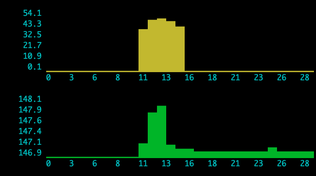

docker-stats-graph
==================

Shows CPU and memory usage of local Docker containers, on the command line.



## Usage

### Prerequisites

* nodejs (tested with v14.16.0)
* docker (tested with 20.10.6)

Install packages:

```
npm install
```

Run:

```
node index.js
```

## Acknowledgements

* [docker-stats](https://github.com/pelger/docker-stats)
* [turtle-race](https://github.com/lbovet/turtle-race)
